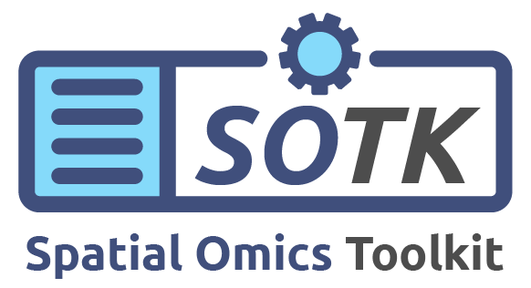

## About
### What is Spatial Omics Toolkit (SOTK)?
 * The SOTK is an R package containing a comprehensive set of functions to identify overrepresented biological modules from spatial transcriptomics profiles. Multiple profiles across different cohorts or platforms can be analyzed by constructing a single correlation network with the deconvoluted outputs using the community search algorithm as an integrative method. Additionally, SOTK allows users to select the optimal rank (latent factor) from multiple NMF runs, i.e., ranks, in a data-driven way by identifying the minimum rank that encompasses the majority, if not all, of the communities grouped by community search algorithms. It was initially developed to analyze Nanostring GeoMx Digital Spatial Profiler (DSP) data, and SOTK is particularly well-suited for cases where multiple segments, e.g., cell types, are independently collected and profiled from the same tissue samples, allowing for the incorporation of numerous segment profiles per sample/patient.
 
### Features
 * Able to find representative latent factors that are biologically meaningful after deconvolution.
 * Optimized for the systematic exploration of each cell type/segment.
 * Helpful in evaluating and exploring a set of genes in a spatio-temporal manner.
 * Integrative analysis of spatial-omics data from multiple cohorts.

## Installation
### Requirement
  * R > 4.3.0
  * Dependencies (alphabetical order):
    * corrr
    * grid
    * igraph
    * methods
    * NMF
    * RColorBrewer
    * stringr

### Install via GitHub
```
install.packages("devtools")
devtools::install_github("UC-ASOC/SOTK")
```

## How-to
### Workflow
  1. Unsupervised deconvolution: NMF (non-negative matrix factorization)
  2. Identification of the biological modules, i.e, a set of metagenes:
    A. Calculate the pairwise correlation coefficients of the metagenes across ranks
    B. Include metagenes with positive correlations and construct a correlation network
    C. Identify communities on the correlation network using the fast greedy algorithm
    D. Select the minimum rank that covers the most communities, i.e., biological modules, at a given rank
    E. Assign AOIs/samples to each metagene based on coefficient values

### Demonstration
  * SOTK has also been implemented on ShinyApp to demonstrate how to analyze the GeoMx DSP data and please visit [https://shinyapps.ucalgary.ca/SOTK](https://shinyapps.ucalgary.ca/SOTK)

